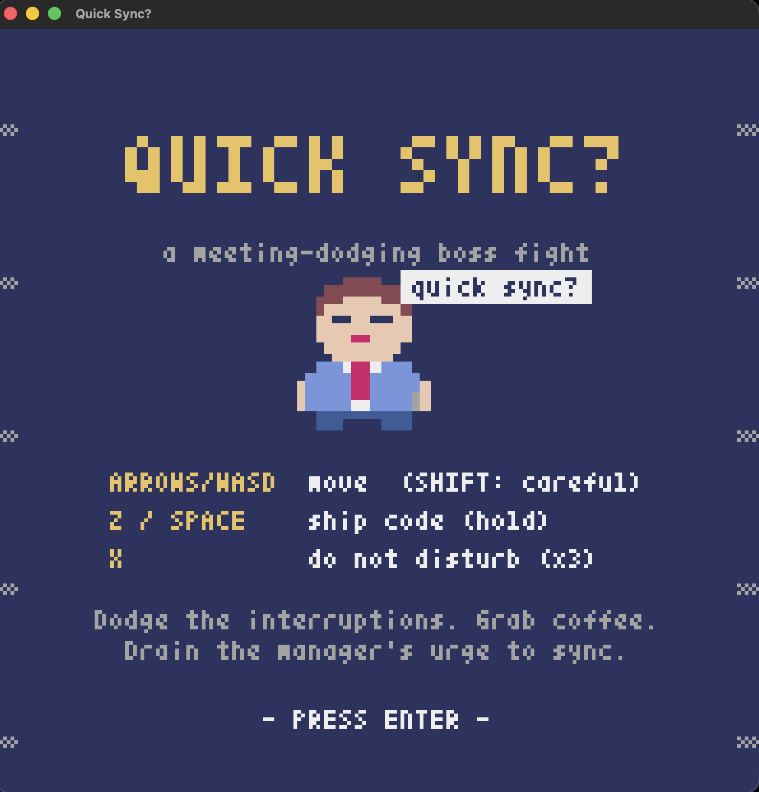
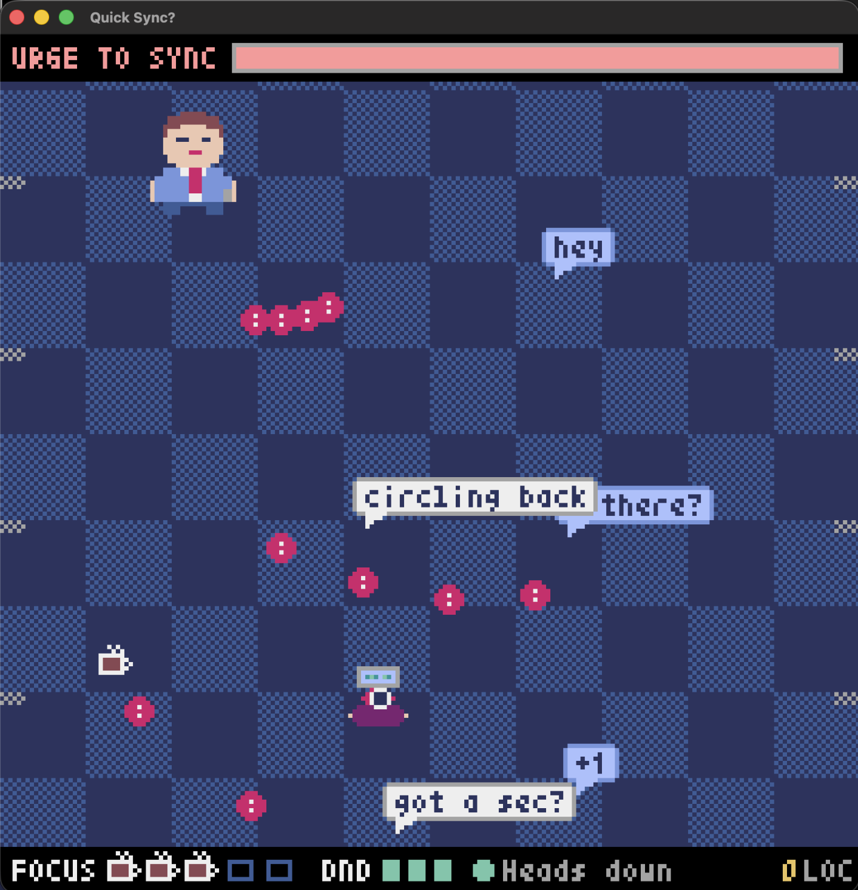

# Quick Sync?

<p align="center">
  
  
</p>

A retro boss-fight shmup built with [Pyxel](https://github.com/kitao/pyxel) 2.9.9.
You're a dev trying to ship. Your manager has *just one quick thing*.

## Run

```bash
python3 -m venv .venv && ./.venv/bin/pip install pyxel==2.9.9   # first time only
./.venv/bin/python main.py
```

## Controls

| Key | Action |
|---|---|
| Arrows / WASD | Move (hold Shift for careful movement) |
| Z / Space (hold) | Ship code at the manager |
| X | Do Not Disturb: clears every interruption, stuns the manager (3 per run) |
| Enter | Start / restart |
| Q / Esc | Quit |

## The fight

Drain the manager's **URGE TO SYNC** bar. Interruptions cost **FOCUS** (coffee cups); grab falling
coffee to refill it. Lose all your focus and you get pulled into a meeting.

| Phase | Manager says | New attack |
|---|---|---|
| 1 | "hey! got a sec?" | Notification-badge spreads, "quick sync?" bubbles, falling pings |
| 2 | "I'll just throw something on your cal" | Calendar-invite walls with one gap |
| 3 | "Can we chat? it won't take long" | A big homing bubble that grows from "Can we chat?" to the full sentence |
| 4 | "per my last message..." | Fast aimed follow-ups ("just bumping this", "URGENT") |

## Tweaking

All tuning lives at the top of `main.py`: `BOSS_HP`, `PLAYER_FOCUS`, `PLAYER_DND`, fire rate, and the
message lists (`SYNC_TEXTS`, `PING_TEXTS`, `INVITE_TEXTS`, `RAGE_TEXTS`, `HIT_QUIPS`). Add your own office
classics there. Attack timing per phase is in `Boss.update`.
